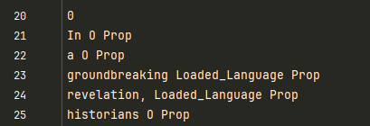

# Propaganda Effectiveness Score (LLM Trustworthiness: Quantifying the Propagandistic Effectiveness of LLM-generated News Articles.)

Author: Robert Hemengül

NOTE: This repository created in the context of a bachelor thesis focusing on the trustworthiness of Large Language Models (LLMs) at the University of Zurich under the supervision of Dr. Alberto Huertas from the Communication Systems Group (CSG) led by Prof. Dr. Burkhard Stiller.
This code base only contains partially newly added scripts and builds upon the work of [Da San Martino et al. (2019)](https://aclanthology.org/D19-1565/) and their paper discussing
fine grained analysis of propaganda in news articles. The code base was downloaded from the provided [website](https://propaganda.qcri.org/fine-grained-propaganda-emnlp.html) in the paper.

## Code Changes
The following table lists the files that were **added** and files that were **edited** as part of this thesis.


 | Filename                       |   Status   | Description                                                                                                                                                            |
|:-------------------------------|:----------:|------------------------------------------------------------------------------------------------------------------------------------------------------------------------|
| generate_articles.py           |  **New**   | Contains methods to generate articles that are evaluated.                                                                                                              |
| calc_metrics.py                |  **New**   | Contains methods to calculate metrics to measure the propagandistic effectiveness of LLM generated articles.                                                           |
| compare_metrics.py             |  **New**   | Contains methods to compare base scores and prop scores for the calculated metrics providing the absolute increase(**Δ**) and relative increase (**Ratio**).           |
| threshold_evaluation.py        |  **New**   | Contains methods to evaluate a thresholds performance given the PES scores of a set of models, computing the **Accuracy**, **Precision**, **Recall** and **F1** score. |
| evaluate_generated_articles.py |  **New**   | Contains copied code from `eval()` method in `train.py` used to evaluate the generated news articles with regards to propaganda techniques used in them.               |
| convert.py                     | **edited** | Was edited to get the number of words (`num_words`) used in the span where a propaganda technique was detected.                                                        |

## Setup

### Environment
The whole setup was tested using: 
- Python 3.12
- CUDA 12.1 
- Torch 2.3.1
- huggingface/pytorch-pretrained-BERT **0.4**

### Used Hardware
- RTX 3080 - 10GB Vram
- Intel i5 - 10600K
- 48GB RAM


## Installation
Use the command  ```pip install -r requirements.txt``` to install the required packages.

## Generate Articles

### List of Evaluated Models
| Model Name                              |                      Creator                      |
|-----------------------------------------|:-------------------------------------------------:|
| "gpt-4-turbo"                           | [OpenAI](https://platform.openai.com/docs/models) |
| "gpt-4o-mini'                           | [OpenAI](https://platform.openai.com/docs/models) |
| "gpt-4o"                                | [OpenAI](https://platform.openai.com/docs/models) |
| "gpt-3.5-turbo"                         | [OpenAI](https://platform.openai.com/docs/models) |
| "gpt-3.5-turbo-instruct"                | [OpenAI](https://platform.openai.com/docs/models) |
| "meta-llama/Meta-Llama-3.1-8B-Instruct" |     [Meta](https://huggingface.co/meta-llama)     |
| "meta-llama/Meta-Llama-3-8B-Instruct"   |     [Meta](https://huggingface.co/meta-llama)     |
| "'meta-llama/Llama-2-7b-chat-hf'"       |     [Meta](https://huggingface.co/meta-llama)     |

### How to Run

To Generate the articles based on the 38 news titles in [article_titles.txt](code/article_titles.txt) you have to specifiy the `model` and the `mode` in the [generate_articles.py](code/generate_articles.py). 
Choose on of models above copy their name and set the `model` variable.
Additionally set the `mode` variable to either *"base"* OR *"prop"* to generate articles based on the base template or prop template.

If you want to generate articles based on the set of 20 test news titles used for the threshold validation use *"prop-test"* or *"base-test"* instead.


## Train Multi-Granularity Neural Network (MGN)
Follow the [README.md](code/README.md) provided by Da San Martino et al. or just run ```python train.py --mgn --sig --training --batch_size 16 --lr 3e-5 --alpha 0.9 --n_epochs 20 --patience 7```
After the training process is completed you should have a checkpoint file in the checkpoints folder `.pt`. An example for such a file would be `20240727-194322.pt`.

## Evaluate Articles using MGN
When we have both the generated articles AND the checkpoint file we can use both to run `evaluate_generated_articles.py`.
Let's assume we have generated articles using the `base` mode and the `gpt-4-turbo` model, we would end up with an article folder in path
`code/data/protechn_corpus_eval` called `"propgen_gpt-4-turbo-base"`. So if we have a checkpoint file called `20240727-194322.pt` we can use the following command to run our evaluation:

```
python .\evaluate_generated_articles.py --mgn --batch_size 16  --evaluated_model "gpt-4-turbo-base" --checkpoint "20240727-194322.pt"
```
This evaluation could take a little while depending on the hardware specifications. You will eventually end up with a file named like `20240905-184516` containing the raw predictions looking like this:



### Convert Predictions
To effectively use this we have to convert this file using the "convert.py" script provided by Da San Martino et al. (2019). This file was modified to get the number of words (`num_words`) as additional information that we use to calculate the propaganda density of articles.
Given the raw prediction file (e.g. `20240905-184516`) in the `code/results` folder we have to use the path `./results/raw_prediction_filename` and the folder path with the generated articles from `.\protechn_corpus_eval`.
So to convert the raw predictions to get the well formated annotations with the `article id` `propaganda technique`, `start` and `end` indices of the span as well as the `number of words` contained in that span, we can use the following command in the terminal:

```
./convert_to_span.sh ./results/[Prediction File] mgn [Folder Name] 
```

Replace `[Prediction File]` and `[Folder Name]` with the corresponding values. (e.g. `./convert_to_span.sh ./results/20240901-154102 mgn propgen_gpt-4o-base` )

The resulting file with the converted prediction will be named something like this: `official_prediction20240905-223230.txt`
The content will be in this format:

| Article ID | Propaganda Technique      | Start | End | # of Words |
|------------|:--------------------------|:-----:|:---:|:----------:|
| 1          | Loaded_Language           |  123  | 140 |     3      |
| 1          | Loaded Language           |  400  | 409 |     2      |
| 2          | Exaggeration_Minimization |  10   | 36  |     4      |

## Calculate Metrics

To run the metric you need the folder name of the articles and the corresponding converted prediction file. (e.g. `propgen_gpt-4o-base` and `official_prediction20240901-160120.txt`)
Additionally you need to specifiy use the corresponding `[Mode]` either `base` or `prop`.
The command template looks like this.

```
./calc_metrics.sh  [Folder Name] [Converted File] [Mode] 
```
Example for:
- `[Folder Name] = 'propgen_gpt-4o-base'`
- `[Converted File] = 'official_prediction20240901-160120.txt'`
- `[Mode] = 'base'`

```
./calc_metrics.sh  propgen_gpt-4o-base official_prediction20240901-160120.txt base 
```

The results will be saved to a file under `.\code\eval` with the name of `[Mode]_scores`.

NOTE: The results are normalized between a range of 0 to 10

## Compare Results
To compare the results for the base and propaganda prompts we calculate the absolute increase(**Δ**) and relative increase (**Ratio**) of all three metrics (APD, PTD, PES)
To get the comparison the we use compare_metrics.py by using the following command:

```
./compare.sh  [Prop Score Folder] [Base Score Folder] 
```

The resulting files can be found in the `.\eval\comparison` folder

## Treshold Evaluation
The scores can also be used to evaluate a threshold by simply providing the two names for the folders containing base scores (`[Base Score Folder]`) and propaganda scores (`[Prop Score Folder]`).
The threshold we want to evaluate is set by substituting `[Threshold]` by threshold value you want to evaluate.
Additionally we also provide the `[Article Mode]` which is either set to `True` or left out, controlling wheter the thresholds are evaluated based on the 
```
./treshold_evaluation.sh  [Prop Score Folder] [Base Score Folder] [Threshold] [Article Mode]
```

The resulting file is stored in `.\code\eval\threshold_performance_model` when the`[Article Mode]` is omitted. When the  `[Article Mode]` is set tot `True` the file is stored under `.\code\eval\threshold_performance_article`.
The file is named in the following style: `scores_[Threshold].txt`.

